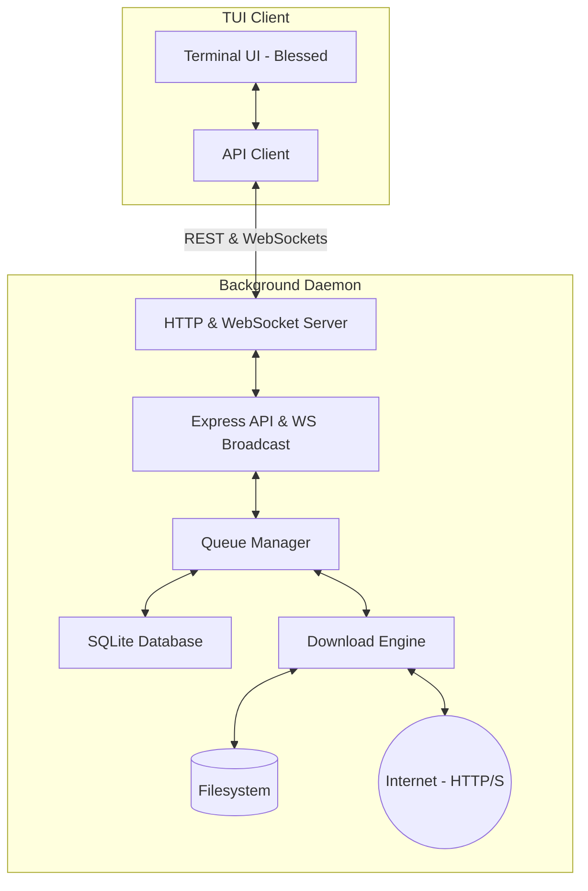

# tdown - Terminal Download Manager

A professional-grade, lightweight Terminal User Interface (TUI) Download Manager for Linux/Ubuntu and macOS/Windows. tdown is designed to run efficiently on headless servers, featuring a background daemon that manages download queues and state, and a highly responsive terminal client that connects to it via HTTP and WebSockets.

tdown prioritizes efficiency, boasting near **0% idle CPU** when the TUI is closed and **20-40 MB RAM** usage. It draws inspiration from premium Linux utilities like `btop`, `lazygit`, and `k9s`.

---

## Features

- **Decoupled Architecture**: Downloads run inside a background daemon. Closing the TUI has **zero** effect on active downloads.
- **Queue and Concurrency Management**: Queues waiting downloads automatically and downloads up to a configurable number of files simultaneously.
- **Hybrid Download Engine (Aria2c + Fallback)**: Automatically detects if `aria2c` is installed in the system. If present, it spawns `aria2c` as a child process to gain multi-connection speedups, automatically handling resume states via `.aria2` control files. If `aria2c` is missing, it seamlessly falls back to our native Node.js `undici` streaming engine (with support for HTTP `Range` resumes).
- **Persistent State**: SQLite database tracks the state of all downloads, facilitating clean recovery of interrupted downloads on daemon start.
- **Robust Client TUI**: Custom panels for active downloads and queues with cyan/gray borders, built-in search/filtering, details dialogs, delete confirmation, and keyboard shortcuts.
- **Throttled SQLite Writes**: Keeps progress updates real-time via WebSockets while updating the SQLite database only once every 5 seconds, drastically reducing disk I/O.
- **Zero-RAM Buffering**: Utilizes native Node.js streams (`pipeline`) to pipe download bytes directly from the network to the filesystem.
- **Auto-reconnection**: Automatically connects and updates the UI whenever the daemon goes offline or restarts.

---

## Keyboard Controls

| Key | Action |
|---|---|
| `Tab` | Switch focus between **Active Downloads** and **Queue** panels |
| `↑` / `↓` | Scroll and select a download item in the focused panel |
| `Space` | Pause or Resume the selected download |
| `N` | Open the **New Download** form (URL & Directory inputs) |
| `C` | Cancel the selected active download |
| `D` | Delete the selected download (opens item + disk file confirmation) |
| `R` | Retry a failed, paused, or cancelled download |
| `H` | Toggle **History Mode** (toggles between showing all items vs. only historical ones) |
| `/` | Open the **Search** bar to filter downloads in real-time |
| `Esc` | Clear search query or close any active popup modal |
| `Enter` | View detailed information about the selected download |
| `Q` / `Ctrl+C` | Quit the TUI client (does **not** stop downloads) |

---

## Installation & Setup

Ensure you have **Node.js (latest LTS, v22+)** and **npm** installed.

1. **Clone & Install Dependencies**:
   ```bash
   cd TDM
   npm install
   ```

2. **Compile the TypeScript Source**:
   ```bash
   npm run build
   ```

3. **Start the Background Daemon**:
   ```bash
   # Runs the daemon in your terminal (or run with systemd / pm2)
   npm run start:daemon
   ```

4. **Launch the TUI Client**:
   ```bash
   # Opens the TUI interface in another window/terminal
   npm run start:client
   ```

---

## System Architecture



- **`/src/config`**: Configuration defaults (port, DB path, concurrency limit, save path).
- **`/src/models`**: TypeScript data structures for `DownloadItem` and system stats.
- **`/src/storage`**: SQLite DB connection management and query layer.
- **`/src/download`**: Core downloading module utilizing `undici` and stream pipelines.
- **`/src/queue`**: Concurrency coordinator, event listener, and scheduler.
- **`/src/services`**: Low-level system performance metrics (CPU, RAM, and Disk space stats).
- **`/src/api`**: Express router and WebSocket gateway.
- **`/src/client`**: Terminal client containing the `blessed` dashboard code and WS apiClient.
- **`/src/utils`**: Text formatting and filename collision utils.

---

## Performance & Optimization Highlights

1. **Idle CPU Near 0%**: System resources (CPU, RAM, disk usage) are only queried if at least one client is connected via WebSocket. When the TUI is closed, the polling stops entirely.
2. **Reduced SQLite Write Overhead**: Writing progress to disk on every chunk can bottleneck the CPU and wear SSDs. tdown updates progress in memory and streams it over WebSockets, saving the state to SQLite only once every 5 seconds, or immediately upon a critical state change (e.g. Pause, Complete, Fail).
3. **No Large Buffers**: Memory usage is kept constant (under 30-40 MB) by piping data using stream pipelines, avoiding loading large download files into RAM.
4. **Resilience to Crashes**: If the daemon crashes, the next startup scans the SQLite DB and shifts all active tasks to `paused` with an `Interrupted` status. This prevents corrupt tasks from getting stuck in a fake downloading state and allows the user to resume them smoothly.

---

## Future Expansion

Because the daemon serves as the single source of truth and exposes standard REST and WebSocket interfaces, you can build alternative clients without touching the download queue logic:
- **Web Dashboard**: A React/Vue interface utilizing Tailwind CSS to monitor downloads from a browser.
- **Telegram/Discord Bot**: Control downloads remotely via chat commands (e.g., `/add URL`, `/status`).
- **MCP (Model Context Protocol)**: Expose tdown as an MCP server tool so AI assistants can trigger downloads.
